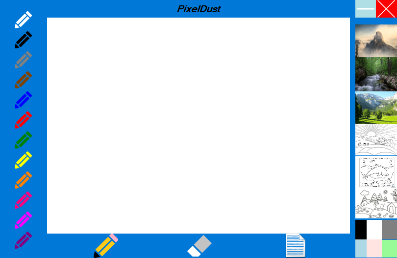

# 🖌️ PixelDust dibujador personalizado

Este proyecto simula una pizarra para colorear o dibujar con controles personalizados **en C#**.

Cada imagen se muestra visualmente y se ve como el lapiz va dibujando.

---

## 📷 Captura del Programa

---

## 🛠 Tecnologías usadas

- C# (.NET Framework)
- Windows Forms
- Controles personalizados

---

## 🚀 Cómo ejecutar

1. Abre el proyecto con Visual Studio
2. Compila y ejecuta (F5)
3. Puedes usar colores de fondo, de pincel, o fondos diseñados

---

## ✍️ Autor

- Carlos Alberto Medina Beltran
